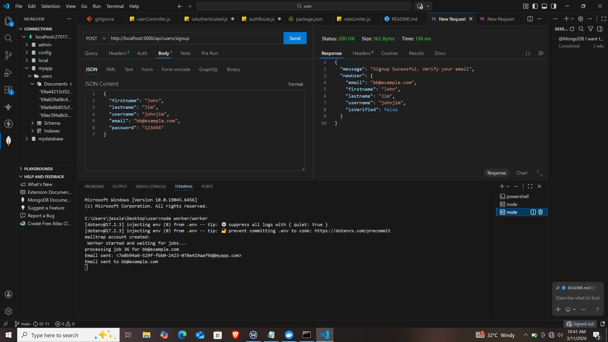
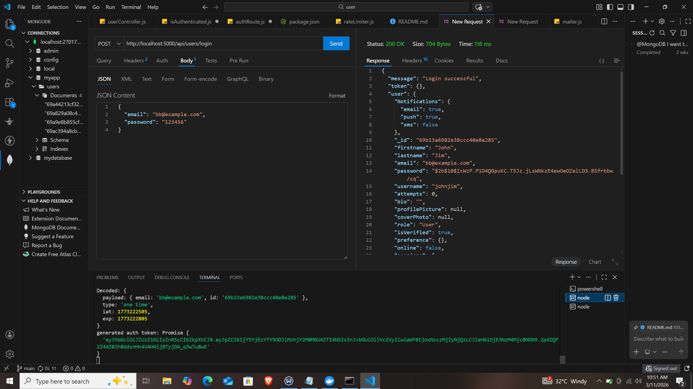
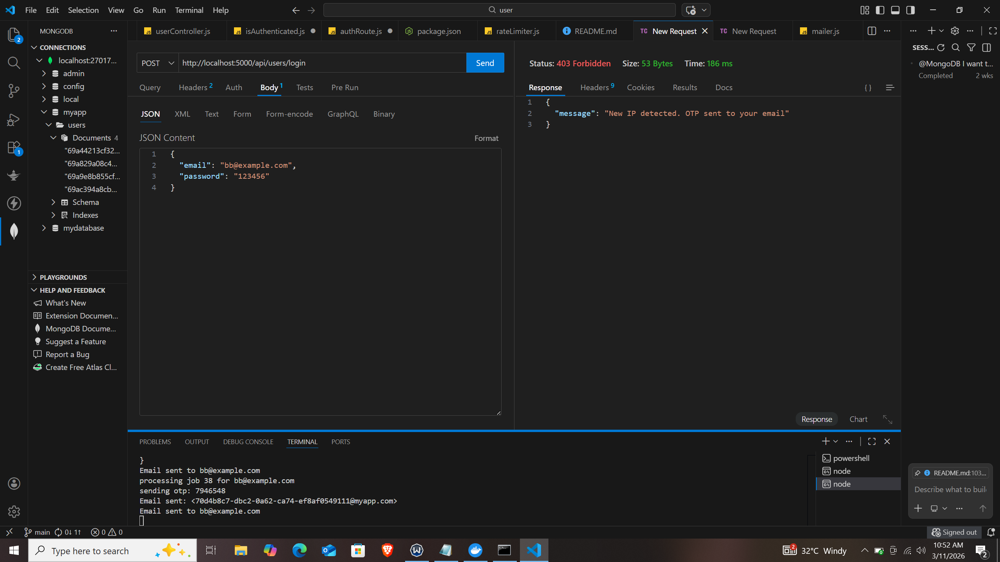
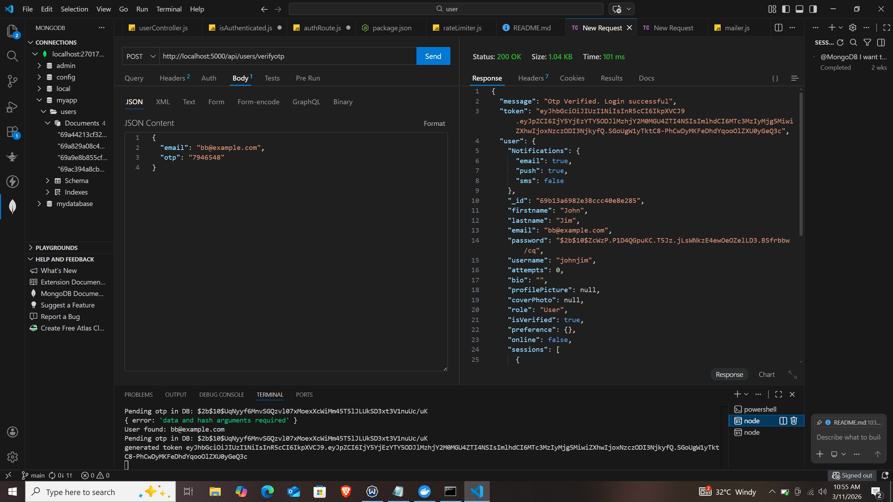
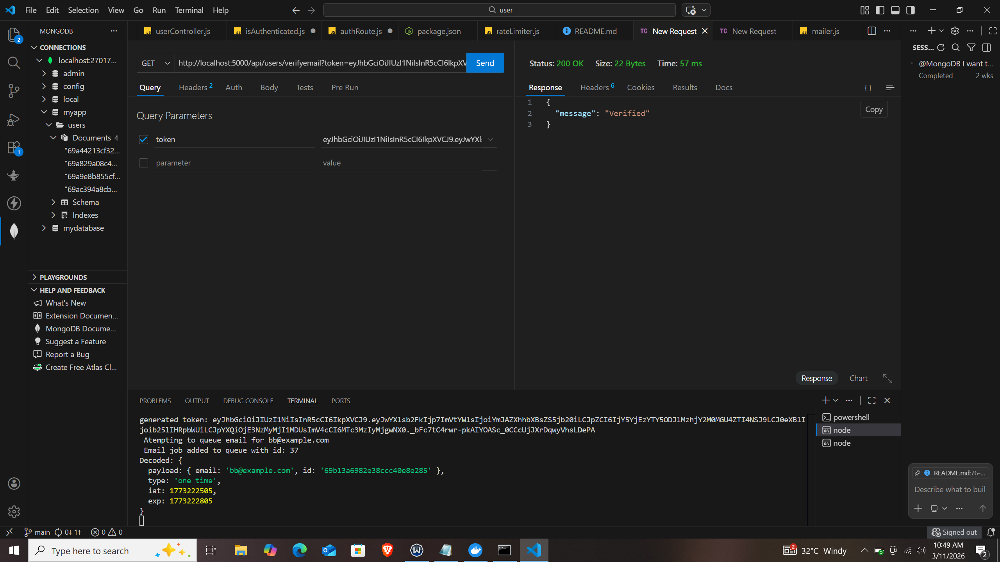
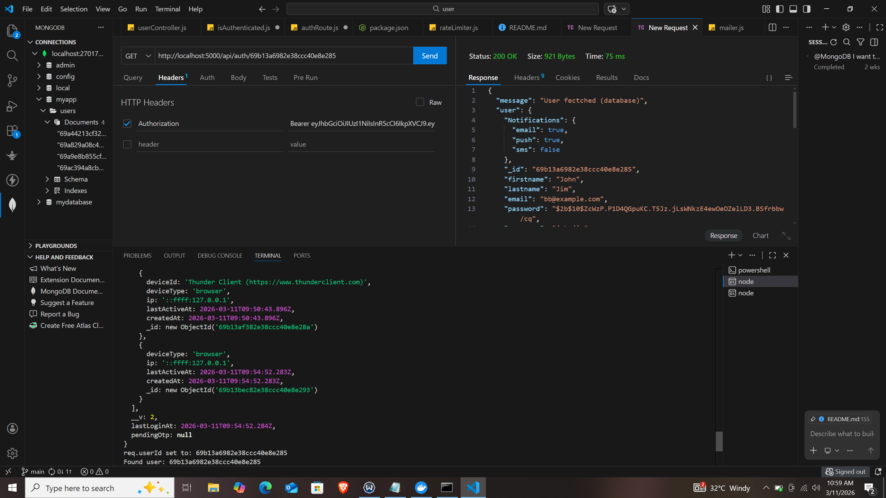

# Authentication System Project

A Node.js authentication system with features including:

- Signup & login  
- OTP verification  
- Email verification  
- Password & input validation  
- Rate limiting  
- Redis caching  
- ETag support  
- Session tracking  
- Email queue & worker process  
- Mailer module  
- Admin routes for user management  

---

## 🔹 Clone & Install

git clone https://github.com/jessiewhite4511/auth-system.git
cd auth-system
npm install
---

## 🔹 Environment Variables

Create a .env file in the root folder:

PORT=5000
MONGO_URI=mongodb://localhost:27017/myapp

REDIS_HOST=127.0.0.1
REDIS_PORT=6379

JWT_SECRET=your_jwt_secret

EMAIL_SERVICE=smtp.mailtrap.io
EMAIL_USER=your_mailtrap_user
EMAIL_PASS=your_mailtrap_pass
---

## 🔹 Redis Setup

This project uses Redis for caching idempotency keys, OTPs, and temporary data.

Run Redis via Docker:

docker run -d --name redis -p 6379:6379 redis
Check if Redis is running:

docker ps
---

## 🔹 Start Server & Worker

Start Node.js server:

node server.js
Start email worker process:

node worker/workers.js
Create the first admin user:

node createAdmin.js
---

## 🔹 API Endpoints

This project has 13 API routes

### 1. Signup

POST /api/users/signup  

Screenshot:

Request Body:

{
  "firstname": "John",
  "lastname": "Jim",
  "username": "johnjim",
  "email": "bb@example.com",
  "password": "123456"
}
Response:

{
  "message": "Signup Successful. Verify your email",
  "newUser": {
    "email": "bb@example.com",
    "firstname": "John",
    "lastname": "Jim",
    "username": "johnjim",
    "isVerified": false
  }
}
---

### 2. Login

POST /api/users/login 

Screenshot:

Request Body:

{
  "email": "bb@example.com",
  "password": "123456"
}
Behavior:

- Login from a new IP triggers OTP verification  
- First attempt sets newIp = true  
- User must login a second time to receive OTP  
- Note: Currently newIp is set on login instead of checking session.ip !== request.ip  

Response:

{
  "message": "Login successful",
  "token": "",
  "user": { ...userData }
}
---

### 3. OTP Verification

POST /api/users/verifyotp  

Screenshot:

Request Body:

{
  "email": "bb@example.com",
  "otp": "123456"
}
Response:

{
  "message": "Otp Verified. Login successful",
  "token": "",
  "user": { ...userData }
}
---

### 4. Email Verification

POST /api/users/verifyemail?token=your_token  

Screenshot:

Response:

{
  "message": "Verified"
}
---

### 5. Get Authenticated User

GET /api/auth/id  

Screenshot:

Headers:

Authorization: Bearer <token>
Response:

{
  "user": { ...userData }
}
---

## 🔹 Features

- Signup with email verification  
- Login with password validation & rate limiting  
- OTP verification for login from new IP  
- Session tracking (IP, device, last login)  
- Password hashing using bcrypt  
- Input validation to prevent SQL injection  
- Redis caching for idempotency keys & temporary data  
- ETag support for caching responses  
- Email queue for asynchronous OTP & verification emails  
- Worker process for sending queued emails  
- Admin routes for user management  

---

## 🔹 Middlewares

- Rate limiter – login route  
- Validator – signup & login inputs  
- isAuthenticated  
- isAdmin  

---

## 🔹 Extras

- Redis stores idempotency keys for signup & email verification  
- Sessions track device ID, type, IP, creation & last active time  
- Security: bcrypt, JWT, OTP for new IP login  

---

## 🔹 Folder Structure

config/
controller/
middlewares/
model/
routes/
uploads/
utils/
worker/
.env
createAdmin.js
README.md
server.js
---

## 🔹 Contributing

1. Fork the repository  
2. Create a branch  
3. Make changes  
4. Submit a pull request  

---

## 🔹 License

MIT